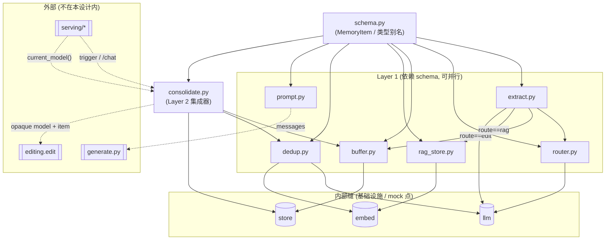
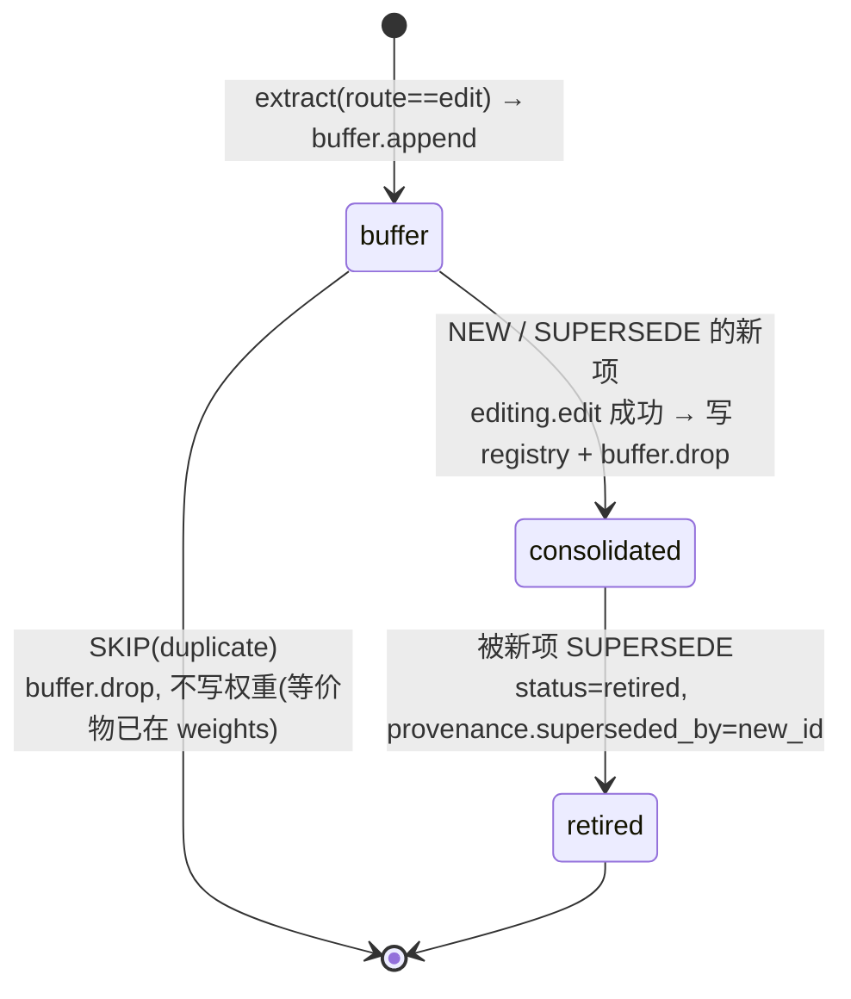

# Engram `memory/` 子系统设计文档

> 状态:implementation-ready 设计(只描述契约与逻辑,不含实现代码)
> 范围:`memory/` 子系统(`schema / extract / router / buffer / rag_store / dedup / consolidate / prompt`)
> 不在本设计内:`serving/`、`eval/`、`frontend/`、`generate.py`、`editing.py` 与 `third_party/horen` 内部 —— 仅作为给定的外部缝引用
> 语言约定:正文中文;类型 / 函数名 / 文件名 / 命令 / 枚举值保留英文原形

## 摘要

`memory/` 是 Engram 的「大脑」:位于 chat 与三个存储(短期 **buffer** / 长期 **edited weights** / 长内容 **RAG store**)之间,负责从自然对话中**抽取**候选记忆、按**形状**路由、在固化时**去重**、把耐久项**固化进模型权重**、并装配固定的 inference **prompt**。它是 **model-independent** 的:自身从不对被编辑模型做 inference,唯一与模型相关的动作是把一个不透明的 model 句柄透传给 `editing.edit`。记忆遵循 complementary-learning-systems 的两速模型 —— buffer 是「整段注入、不检索」的短期工作记忆,edited weights 是「内化、不检索」的长期记忆,RAG store 是**全系统唯一发生 retrieval(vector top-k)** 的长内容层。写路径:`extract → route →(edit→buffer / rag→rag_store)`;触发后 `consolidate` 排空 buffer,逐条 `dedup` 后 dispatch(`skip / supersede / new`),经 `editing.edit` 写入权重并从 buffer drop。读路径:固定 prompt 骨架始终跑在 edited model 上。hero proof:**全新会话 + 关闭检索**,仅凭权重答对一个刁钻问题。

## 模块依赖草图



实线 = `memory/` 内部依赖;圆柱 = 内部基础设施缝(可 mock);虚线 + 双框 = 外部缝(不在本设计内)。

---

## 1. 目的与边界

### 1.1 `memory/` 是什么

`memory/` 是聊天与存储之间的协调层。它承担:从对话抽取候选(`extract`)、按形状路由(`router`)、维护短期 inbox(`buffer`)、长内容索引与检索(`rag_store`)、固化期语义去重(`dedup`)、把 buffer 折叠进权重(`consolidate`)、装配 inference prompt(`prompt`)。`schema` 是它们共享的数据契约。

### 1.2 两速记忆模型(complementary learning systems 类比)

| 层 | 角色 | 读取方式 | 写入方式 | 大小 |
|---|---|---|---|---|
| **buffer** | 短期、未固化的工作记忆 | inference 时**整段注入**(NO retrieval) | `buffer.append`(route==edit) | 小(设计如此) |
| **edited weights** | 长期、已固化记忆 | 模型**内化**(NO retrieval) | `editing.edit`(由 `consolidate` 调用) | —(在模型里) |
| **RAG store** | 长内容存储 | **vector top-k retrieval(全系统唯一检索点)** | `rag_store.add`(route==rag) | 大 |

### 1.3 所处位置与边界

- **上游(谁调用 `memory/`)**:`serving/`。`serving/app.py` 在 `/chat` 调 `extract` 并 dispatch 到 buffer/rag;`serving/triggers.py` 调 `consolidate.run_pass`;`generate.py` 调 `prompt.build_prompt`。依赖方向是 `serving → memory`,**绝不反向**(`memory/` 不 import `serving/`;model 句柄的取得见 §7 的解耦方案)。
- **与 `editing/` 的边界**:`memory/` 只通过 `editing.edit(model, memory)` 这**唯一一个缝**触达权重编辑。它不知道 HoReN 细节、不假设返回形态、不做热插拔(那是 `serving/model_host` 的事)。详见 §7。
- **model-independent**:`memory/` 从不对 edited model 做 inference(INV-7)。它对模型的唯一接触是把不透明句柄透传给 `editing.edit`。
- **通用 LLM 的使用**:`extract / router / dedup` **可以**调用一个通用 LLM(hosted API 或小模型)做判断。这些调用必须可 mock(经 §4.0 的 `llm` 缝)。

### 1.4 明确不在本设计内

`serving/`、`eval/`、`frontend/`、`generate.py`、`editing.py` 实现与 `third_party/horen` 内部。本文只在边界处引用它们的签名。

---

## 2. 不变量(invariants)

以下为实现**不得违反**的约束。

- **INV-1 路由按 shape,不按 category。** `route=="edit"` 当且仅当 `atomic ∧ internalize ∧ stable`;否则 `"rag"`。`type`(`fact/preference/belief/jargon`)只是标签,**不**决定 route。
- **INV-2 dedup 只在 consolidation 时发生,绝不在入 buffer 前。** buffer 是 raw、un-deduped 的 inbox。
- **INV-3 三层语义固定且不可混淆:** buffer = 整段注入(whole-inject,无检索);weights = 内化(intrinsic,无检索);RAG = 检索(retrieval)。
- **INV-4 no-double-existence。** 同一条 knowledge 不同时存在于两层。一个 `MemoryItem` 任一时刻只有一个 `status`;固化成功后它从 buffer 转入 weights(并从 buffer drop)。
- **INV-5 RAG 窗口结构恒在。** `prompt` 永远渲染 RAG 窗口(两段),内容可空。
- **INV-6 读路径永远跑在 edited model 上。**
- **INV-7 model-independent。** `memory/` 不对 edited model 做 inference。
- **INV-8 route 决定归宿且不可逆切换。** `route=="rag"` 的 item 永久存于 RAG、**永不** consolidate、永不被 supersede;`route=="edit"` 的 item 经 `buffer → weights`。
- **INV-9 两层「太近」只管第二层。** 见 §2.1。
- **INV-10 冲突解决按 recency。** buffer/context(最近)覆盖 weights 旧值;固化后 weights 更新且该 buffer 项被 drop(回到 INV-4)。

### 2.1 两层「太近」(only Layer-2 是 `memory/` 的职责)

- **Layer-1(非 `memory/` 职责):** editing library(HoReN)自带的 codebook 自动处理 key-space 的近似精确重复。`memory/` 不重复实现它。
- **Layer-2(`memory/dedup` 的职责):** app 级**语义**去重 —— 同一事实不同措辞(如「I prefer Postgres」vs「for OLTP I default to Postgres」)。机制:embedding 最近邻 +(可选)fast-LLM judge,分类 same / changed / new → `Decision`。

---

## 3. 数据模型

### 3.1 类型别名(冻结,来自 `schema.py` / `dedup.py`)

```python
MemoryType   = Literal["fact", "preference", "belief", "jargon"]   # 仅标签, 不决定 route
Route        = Literal["edit", "rag"]
Status       = Literal["buffer", "consolidated", "retired"]
DedupVerdict = Literal["duplicate", "supersede", "new"]            # 在 dedup.py
```

与 brief 的枚举映射:`EDIT≡"edit"`、`RAG≡"rag"`;`SKIP≡"duplicate"`、`SUPERSEDE≡"supersede"`、`NEW≡"new"`。

### 3.2 `MemoryItem`(冻结 dataclass)

```python
@dataclass
class MemoryItem:
    id: str
    type: MemoryType
    text: str
    route: Route
    status: Status
    source: str
    ts: float
    provenance: Optional[dict] = None
```

| 字段 | 类型 | 必填 | 语义 |
|---|---|---|---|
| `id` | `str` | ✓ | 稳定唯一 id(建议 `mem_<uuid4-hex 前缀>`) |
| `type` | `MemoryType` | ✓ | 标签;不决定 route(INV-1) |
| `text` | `str` | ✓ | 规范化自然语句。route==edit 时强约束为 **≤~15 词的 proposition**;route==rag 时放宽(可为长内容) |
| `route` | `Route` | ✓(**无默认值**) | `edit`→weights / `rag`→检索 |
| `status` | `Status` | ✓ | 生命周期位(§3.3) |
| `source` | `str` | ✓ | 来源(chat turn / message id) |
| `ts` | `float` | ✓ | 创建时间(epoch 秒) |
| `provenance` | `Optional[dict]` | 否(默认 `None`) | 自由谱系(§3.4) |

**关键推论:`route` 无默认值 = 必填。** 因此**不存在「未路由的 MemoryItem」**:任何 item 在构造时就必须已有 route。这把 brief 中独立的 `Candidate` 类型折叠掉了 —— `Candidate` 只是「已抽取、尚未定 route」的概念阶段,不落地为类型(见 §4.1 / §4.2 如何用占位 route 处理)。

与 brief 的字段映射:brief 的 `status ∈ {active, retired}` → 本设计用三态,`active ≡ {buffer, consolidated}`;`created_at ≡ ts`;`superseded_by` 落在 `provenance`(§3.4);`type`/`source` 是真实多出的字段。

**route==rag 的 item 的 `status`:** 三态本为 edit 流水线设计。约定 rag item 在写入 `rag_store` 时 `status="consolidated"`(语义:已落入永久层、不再变动),且不进入 dedup/supersede(INV-8)。这是对三态的复用而非新增(略有语义拉伸,§10 记录)。

具体示例:

```text
# edit 路由 (atomic ∧ internalize ∧ stable)
MemoryItem(id="mem_a1", type="preference",
           text="用户做 OLTP 默认用 Postgres",
           route="edit", status="buffer", source="msg_42", ts=1750000000.0,
           provenance={"source_msg": "msg_42"})

# rag 路由 (长内容, 不可压缩)
MemoryItem(id="mem_b7", type="fact",
           text="<用户粘贴的三段会议纪要全文 …>",
           route="rag", status="consolidated", source="msg_77", ts=1750000100.0,
           provenance={"source_msg": "msg_77"})
```

### 3.3 `MemoryItem` 生命周期状态机(edit 路由)



- `buffer`:在短期 inbox,未固化。
- `consolidated`:已写入权重(且在 consolidated registry 留有元数据记录,供 dedup 比对 / UI 展示 —— **此记录不被检索注入 prompt**,知识本体在权重里)。
- `retired`:被新项取代,保留以供审计/回溯。

注:`SKIP` 的 buffer 项也会 `buffer.drop`(只是不写权重、不计 `n_written`),以保证 buffer 被真正 drain、不让 duplicate 永久卡住(对 brief「do nothing」的合理细化,§5 / §10)。

### 3.4 provenance 模型

`provenance` 是自由 `dict`(schema 已如此)。约定键(均可选;实现应集中在一处常量定义键名,避免漂移):

| 键 | 写入时机 | 语义 |
|---|---|---|
| `source_msg` | 创建时 | 原始来源 message id(细化 top-level `source`) |
| `supersedes` | 新项固化(SUPERSEDE)| 它取代了哪个 old id |
| `superseded_by` | 旧项被取代 | 取代它的 new id(即 brief 的 `superseded_by`)|
| `edit_ref` | 固化成功后 | `editing.edit` 返回的稳定标识(不透明;SPIKE 0 确认其为 `HopfieldAdapter` 子模块,memory/ 仍按不透明处理,§7),用于审计 |
| `consolidated_at` | 固化成功后 | 固化时间(epoch 秒)|
| `duplicate_of` | SKIP(可选审计)| 与哪个已固化项重复 |

### 3.5 序列化 / 持久化表示

`schema.py` 标了 TODO「serialization / validation helpers」。`serving/store.py` 的 `upsert_memory / get_memories` 收发 `dict`(非 `MemoryItem`),因此需要 `MemoryItem ↔ dict` 的 (de)serialize(`dataclasses.asdict` + 反向 `from_dict` + 轻校验)。建议作为 Layer-0 的 schema helper 一并补齐。详见 §10-6。

### 3.6 `Decision`(dedup 输出 —— 已定,随 `schema` 冻结于 Layer 0)

裸枚举 `DedupVerdict` **携带不了 supersede 的 old_id**,而 `dedup`(L1)/`consolidate`(L2)都 load-bearing、签名直接依赖它。solo 开发无「团队确认」环节 —— **此处直接定为方案 A,并随 `schema` 一同冻结**(冻结必须含这个决定,否则 dedup/consolidate 一直返工、等于没冻):

```python
@dataclass
class Decision:
    verdict: DedupVerdict           # "duplicate" | "supersede" | "new"
    target_id: Optional[str] = None # supersede 时 = 被取代旧项的 id; 否则 None
```

`classify` 返回 `Decision`;`consolidate` 直接用 `decision.target_id`(`DedupVerdict` 保留为 verdict 的枚举)。

**否决方案 B(consolidate 自己用 NN top-1 复原 target):** footgun —— dedup 的 LLM judge 据以判 supersede 的那条 neighbor,与 consolidate 事后独立复原的 NN top-1 可能不是同一条 → 退休错对象。方案 A 让 judge 把锁定的 `target_id` 直接传出,杜绝此不一致。

---

## 4. 模块规格

每个模块给出:职责 / public interface / I·O / 内部逻辑 / edge cases / 依赖 / minimal-vs-full。先说三个被多模块共享的**内部缝**。

### 4.0 内部基础设施缝(新增;非 Wave-0 公共契约;集中 mock 点)

这三个缝 + `editing.edit` 共四个 mock 点,是 §9 测试的关键。

- **`llm` 缝(建议 `memory/llm.py`)** —— 单一函数封装通用 LLM 调用,如:

  ```python
  def complete(messages: list[dict], *, temperature: float = 0.0,
               response_format: Optional[dict] = None) -> str: ...
  ```

  被 `extract / router / dedup` 依赖;测试只 monkeypatch 这一个函数即可脱离真实 API。沿用 repo 既有 pattern(OpenAI SDK,`base_url` 指向 DeepSeek,`model="deepseek-chat"`,key 经配置/参数传入,**不**硬编码读 env)。
- **`embed` 缝(建议 `memory/embed.py`)**:

  ```python
  def encode(texts: Sequence[str]) -> list[list[float]]: ...   # 或 np.ndarray
  ```

  被 `rag_store / dedup` 依赖;`sentence-transformers` + `all-MiniLM-L6-v2`(repo 既有先例),cosine 手算(无独立向量库)。模型 lazy-load 单例。测试 mock `encode` 返回确定向量。
- **`store` 缝(持久化抽象)**:hero = 进程内(module-level `dict`/`list`);full = Mongo(`serving/store.py` 的 `memories` + `provenance` collections)。**buffer 与 consolidated registry 共享一个 `memories` 逻辑表,按 `status` 切片;`rag_store` 用独立 collection。** 详见 §10-5。

---

### 4.1 `extract.py`

- **职责**:用 LLM 从自然对话抽取候选记忆,逐条 route,返回**已 route、未持久化**的 `MemoryItem`。这是自动抽取,**不是**手动 save。
- **接口(冻结)**:`extract(chat: Sequence[dict]) -> list[MemoryItem]`(`chat` = OpenAI 风格 `[{"role","content"}, …]`)。
- **输入/输出**:近期对话片段 → `list[MemoryItem]`,每条 route 已定。**不**调用 `buffer.append`/`rag_store.add`(持久化是写路径 orchestrator 的事,§5)。
- **内部逻辑**:
  1. 构造抽取 prompt(few-shot:鼓励原子化、≤15 词 proposition;要求输出结构化 JSON list,每条含 `text` 与猜测的 `type`)。
  2. `llm.complete` → 解析 JSON → 候选 `{text, type}`。
  3. 对每条候选构造 `MemoryItem`(分配 `id`、`source`=来自 chat 的 message id、`ts`、`status="buffer"`、**占位 `route="rag"`**),调 `router.route(item)` 得最终 route 并回填 `item.route`。
  4. 返回 list。
- **edge cases**:LLM 返回空/非法 JSON → 返回 `[]` 并记日志;无可抽取 → `[]`;一句产生多条原子项是允许的;**不在此去重**(INV-2)。
- **依赖**:`llm` 缝、`router`、`schema`。
- **Minimal(hero)**:单次 LLM 调用 + 朴素 JSON 解析 + 固定 few-shot。**Full**:输出 schema 强校验、置信度、批处理、coref 消解、多语言。

### 4.2 `router.py`

- **职责**:决定 item 的 route,轴是 **shape** 不是 category(INV-1)。
- **接口(冻结)**:`route(item: MemoryItem) -> Route`。**只读 `item.text`(及 `item.type` 作弱信号),不读入参的 `route` 字段**(因为调用它正是为了定 route)。
- **规则**:`route=="edit"` 当且仅当
  - **atomic**:可压缩成一个 ≤~15 词的 proposition(单句),且
  - **internalize**:模型应「表现得像知道这件事」,而非检索-复述,且
  - **stable**:不是频繁改写的瞬时状态。

  三者皆真 → `"edit"`;否则 `"rag"`。
- **内部逻辑**:
  - `atomic`:词数/长度阈值(≤~15 词且单句)—— 廉价确定性判断。
  - `internalize` & `stable`:`llm` 缝小分类(few-shot 返回布尔/最终 route)。Minimal 可先用启发式(含「我喜欢/我是/我用/记住」偏 internalize;含 URL/代码块/「这是文档/纪要」偏 rag;含「现在/今天/暂时」偏 transient→rag)。
- **示例**:

  | text | 判定 | route |
  |---|---|---|
  | 「我做 OLTP 默认用 Postgres」 | atomic∧internalize∧stable | edit |
  | 「我对花生过敏」 | atomic∧internalize∧stable | edit |
  | 「我觉得渐进式类型优于动态类型」(belief) | atomic∧internalize∧stable | edit |
  | 粘贴的 200 行会议纪要 | ¬atomic | rag |
  | 「项目 X 的完整 API 文档」 | ¬atomic ∧ retrieve-and-recite | rag |
  | 「我现在在排队买咖啡」 | ¬stable(transient) | rag(或不抽取)|

- **edge cases**:边界词数;LLM 不确定 → **默认 `"rag"`**(更安全:rag 可逆、不动权重;代价见 §10-10)。
- **依赖**:`llm` 缝、`schema`。
- **Minimal**:确定性长度判断 + 轻量启发式/单次 LLM。**Full**:稳健的 LLM shape 分类 + 置信度阈值。

### 4.3 `buffer.py`

- **职责**:route==edit 的短期 inbox。小。**NO dedup**(INV-2)。
- **接口(冻结)**:
  - `append(item: MemoryItem) -> None` —— 原样加入(`status="buffer"`)。
  - `load_unconsolidated() -> list[MemoryItem]` —— 返回所有 `status=="buffer"` 的项。
  - `drop(ids: Sequence[str]) -> None` —— 按 id 移出 buffer(consolidation 后调用)。
- **内部逻辑**:hero = module-level `dict`(id→item)/`list`;full = Mongo `memories` 过滤 `status=="buffer"`。`append` = upsert `status="buffer"`;`drop` = 从 buffer 切片移除(对应 §5 的「写 consolidated 记录 + drop buffer 记录」转移)。
- **edge cases**:重复 `append` 同 id(覆盖或忽略,二选一并固定);`drop` 不存在的 id(忽略);并发(hero 单进程忽略,full 靠 Mongo)。buffer 深度 = `len(load_unconsolidated())`(供 trigger 用)。
- **依赖**:`store` 缝、`schema`。
- **Minimal**:内存 `dict`。**Full**:Mongo + change-stream 触发。

### 4.4 `rag_store.py`

- **职责**:route==rag 的长内容层。永久,**永不** consolidate(INV-8)。**全系统唯一 retrieval。**
- **接口(冻结)**:
  - `add(item: MemoryItem) -> None` —— embed(`item.text`)+ 持久化(向量 + item);写入时设 `status="consolidated"`(§3.2 约定)。
  - `search(query: str, k: int = 5) -> list[MemoryItem]` —— 对 query embed,取 top-k cosine。
- **内部逻辑**:`embed` 缝 `encode`;hero = 内存 list + 暴力 cosine;full = Mongo 存向量 + 暴力/后续索引(本地 Mongo 无 `$vectorSearch`)。**rag_store 不做语义去重**(dedup 只服务 edit 路由)。
- **edge cases**:空库 → `search` 返回 `[]`;`k` > 库大小 → 返回全部;重复 `add` 被接受(检索靠相关性处理)。
- **依赖**:`embed` 缝、`store` 缝、`schema`。
- **Minimal(thin)**:hero proof 里 RAG off、docs 段可不被触发 —— 内存 + 暴力 cosine 足矣(`search` 甚至可暂返回 `[]`)。**Full**:Mongo 持久化 + chunking + re-rank。

### 4.5 `dedup.py`

- **职责**:consolidation 时判定 `candidate` vs 已固化记忆 → `Decision`。Layer-2 **语义**去重(INV-9)。**运行于 consolidation,不在入 buffer 前(INV-2)。**
- **接口**:冻结签名为 `classify(candidate: MemoryItem, consolidated: Sequence[MemoryItem]) -> DedupVerdict`。**已定细化为返回 `Decision`**(§3.6,随 `schema` 冻结于 L0),以携带 supersede 的 `target_id`:

  ```python
  def classify(candidate: MemoryItem,
               consolidated: Sequence[MemoryItem]) -> Decision: ...
  ```

- **内部逻辑**:
  1. `embed.encode` 求 `candidate.text` 与 `consolidated` 各项的向量(后者可预存),算 cosine,取最近邻 `nn` 与相似度 `sim`。
  2. `sim < T`(阈值,建议 `0.85`,呼应 HoReN 习惯)→ `Decision("new")`。
  3. `sim ≥ T`:
     - **Minimal**:用相似度 + 简单规则区分 —— 极高相似且 text 近乎一致 → `duplicate`;高相似但表述/取值有别 → `supersede(target=nn.id)`。
     - **Full**:调 `llm` 缝 judge(`candidate` vs `nn.text`)分类 same / changed / new → `duplicate` / `supersede(target=nn.id)` / `new`。
- **`Decision` 表达(已定 = 方案 A)**:`classify` 返回 `Decision{verdict, target_id}`,`consolidate` 直接用 `decision.target_id`。已随 `schema` 冻结于 L0;否决「consolidate 自己 NN top-1 复原」的 footgun(target 不一致)理由见 §3.6。
- **edge cases**:`consolidated` 为空 → 一律 `new`;candidate 接近多条 → 取 top-1(多目标 supersede 暂不支持,§10-11);阈值边界;LLM judge 不可用 → 退化为纯阈值(minimal)。
- **依赖**:`embed` 缝、`llm` 缝(full)、`schema`。
- **Minimal**:exact / embedding-NN + 阈值。**Full**:加 fast-LLM judge。

### 4.6 `consolidate.py`(Layer 2 集成器)

- **职责**:把 buffer 折叠进权重。返回 `n_written`(UI 计数器)。
- **接口(冻结)**:`run_pass(trigger: str) -> int`。`trigger` = 来源标签(`"manual"|"timer"|"threshold"|"change_stream"`)。**无 model 参数** → model 句柄从 editing/serving 层取(§7)。
- **内部逻辑(伪代码;非实现)**:

  ```text
  def run_pass(trigger):
      model = <取不透明 model 句柄, 见 §7>          # memory/ 不 inference, 仅透传
      items = buffer.load_unconsolidated()
      registry = <consolidated registry: status=="consolidated" 的 edit-route 项>
      n_written = 0
      for it in items:
          d = dedup.classify(it, registry)           # 方案A: -> Decision
          if d.verdict == "duplicate":               # SKIP
              buffer.drop([it.id])                    # 细化: SKIP 也出 buffer (drain)
              continue
          if d.verdict == "supersede":
              old = registry.get(d.target_id)
          ref = editing.edit(model, it)              # 不透明返回; 先确保新值写入
          # —— 以下仅在 editing.edit 成功后执行 ——
          if d.verdict == "supersede":
              old.status = "retired"
              old.provenance = {**(old.provenance or {}), "superseded_by": it.id}
              registry.put(old)
              it.provenance = {**(it.provenance or {}), "supersedes": old.id}
          it.status = "consolidated"
          it.provenance = {**(it.provenance or {}),
                           "edit_ref": ref_id(ref), "consolidated_at": <ts>}
          registry.put(it)
          registry.append_in_pass(it)                # 让本趟后续 dedup 看见新项
          buffer.drop([it.id])
          n_written += 1
      return n_written
  ```

- **关键点**:
  - **drain 语义**:每条都被处理并移出 buffer(含 SKIP)。
  - **失败处理**:`editing.edit` 抛错 → 该项**不** drop、不计 `n_written`、且(对 supersede)**不** retire old(retire 排在 edit 成功之后)→ 留待下趟重试。
  - **同趟可见性**:新固化项加入本趟 registry,使同一趟内的两条近似项第二条能 dedup 到第一条(避免一趟内写入重复)。
  - **`n_written`** 只数真正 `editing.edit` 成功的(NEW + SUPERSEDE),不含 SKIP。
- **edge cases**:空 buffer → 返回 0;`editing.edit` 失败;supersede 的 target 已不在(并发)→ 退化为 NEW;model 句柄取不到 → 抛错并报告。
- **依赖**:`buffer`、`dedup`、`editing`(外部缝)、`store`/registry、`schema`。**不依赖 `rag_store`**(rag 路由不经 consolidation)。
- **Minimal**:顺序处理 + 内存 registry + 直接 "Consolidate Now"。**Full**:Mongo registry + change-stream 触发 + 批/并发 + 重试 + 更强原子性。

### 4.7 `prompt.py`

- **职责**:装配固定 inference prompt 骨架。RAG 窗口恒在(INV-5)。**纯函数**(无 LLM/embed/store/model 依赖,最易测)。
- **接口(冻结)**:`build_prompt(query: str, buffer: Sequence[MemoryItem], rag_hits: Sequence[MemoryItem]) -> list[dict]`(返回 OpenAI 风格 `messages`)。
- **注**:`system` 是**模块内常量模板**(不在签名里);`history` 当前**未线程化**(hero = 全新会话无 history)。多轮扩展见 §10-4。
- **骨架与版式**:见 §6。
- **edge cases**:`buffer`/`rag_hits` 为空 → 段落渲染占位文本「(暂无)」,**但段落结构保留**(INV-5);超长 → buffer 设计上小,rag_hits 受 `k` 限;注入安全 → 对 `item.text` 编号/加分隔符,避免破坏结构。
- **依赖**:`schema`(只读 `MemoryItem.text`)。
- **Minimal**:固定模板字符串拼接。**Full**:token 预算裁剪、更讲究的格式、多轮 history。

---

## 5. 写路径(端到端)

### 阶段一:抽取与路由(同步,`/chat` 时)

1. 用户对话 → `serving` `/chat` 收到 `messages`。
2. `items = extract(chat)`:LLM 抽候选 → 每条 `router.route` 回填 → 返回 `list[MemoryItem]`(**未持久化**)。
3. **写路径 dispatch**(薄逻辑,归属 `serving` orchestrator,调用 `memory/` 的 public API):

   ```text
   for it in items:
       if it.route == "edit":
           buffer.append(it)                 # status="buffer"; NO dedup (INV-2)
       else:  # "rag"
           it.status = "consolidated"        # 永久层 (§3.2)
           rag_store.add(it)                 # embed + 持久化; 永不 consolidate (INV-8)
   ```

   UI buffer 计数 = `len(buffer.load_unconsolidated())`。

### 阶段二:固化触发

4. `serving/triggers.py` 之一触发:manual("Consolidate Now")/ timer / buffer 长度 ≥ K / change-stream。全部调 `consolidate.run_pass(trigger)`。

### 阶段三:consolidation pass(`consolidate.run_pass`)

5. 取 model 不透明句柄(§7)。
6. `items = buffer.load_unconsolidated()`;`registry = status=="consolidated"` 的 edit-route 项。
7. 逐条 `dedup.classify` 后 dispatch:

   - **SKIP(`duplicate`)**:不调 `editing.edit`;`buffer.drop([it.id])`;不计 `n_written`;(可选)`provenance.duplicate_of` 审计。
   - **SUPERSEDE(`supersede`, `target_id`)**:
     1. `old = registry.get(target_id)`。
     2. `ref = editing.edit(model, it)`(先确保新值写入权重)。
     3. 成功后:`old.status="retired"`、`old.provenance["superseded_by"]=it.id`、`registry.put(old)`。
     4. `it.status="consolidated"`、`it.provenance += {supersedes: old.id, edit_ref: ref_id(ref), consolidated_at}`、`registry.put(it)`。
     5. `buffer.drop([it.id])`;`n_written += 1`。
   - **NEW(`new`)**:
     1. `ref = editing.edit(model, it)`。
     2. `it.status="consolidated"`、`it.provenance += {edit_ref: ref_id(ref), consolidated_at}`、`registry.put(it)`。
     3. `buffer.drop([it.id])`;`n_written += 1`。

8. 返回 `n_written`(UI 计数器 += n)。

### provenance / supersession 处理小结

- 新项:记 `supersedes`(若有)/ `edit_ref` / `consolidated_at`。
- 旧项(被取代):记 `superseded_by`,`status → retired`(保留以供审计/回溯)。
- **no-double-existence(INV-4)**:item 单 status;`buffer → consolidated` 是一次转移(写 registry + `buffer.drop`);supersede 后权重旧值被新值覆盖(由 `editing` 负责),registry 里 old 标 `retired`。

### 原子性与失败(弱保证,可接受)

- `editing.edit` 失败:不 drop、不计、不 retire old → 下趟重试。
- 顺序恒为「**edit 成功 → 改 status/registry → drop buffer**」。崩溃后 buffer 仍含该项;重跑会 re-dedup —— 若权重其实已写入,则判 `duplicate` → SKIP + drop,**幂等自愈**。
- SUPERSEDE 的 retire-old 与 write-new 非真事务(无分布式事务)。采「edit 新值成功后再 retire old」顺序;最坏情况 = old 未退休但新值已写,下趟 dedup 自愈。详见 §10-8。

---

## 6. 读路径

### 6.1 精确 prompt 骨架(`build_prompt` 的确定版式)

```text
messages = [
    {"role": "system", "content": SYSTEM_PROMPT + "\n\n" + RAG_WINDOW},
    *history,                      # 预留; hero = 全新会话, 为空
    {"role": "user", "content": query},
]
```

- `SYSTEM_PROMPT`:常量(身份/风格/「优先采纳用户事实并据此行动」的总则)。
- `RAG_WINDOW`:**恒在**(INV-5),两段,内容可空:

  ```text
  【关于用户的事实与偏好 —— 默认采纳并据此行动】
  {buffer 段: 逐条编号渲染 item.text; 为空时写 "(暂无)"}

  【参考材料 —— 仅供参考, 不改变上述默认行为】
  {docs 段: 逐条编号渲染 rag_hits 的 item.text; 为空时写 "(暂无)"}
  ```

  (RAG 窗口置于 system content 内,最跨模型可移植;两段标题/结构始终出现,即使正文为「(暂无)」。)

### 6.2 两段的措辞与语义

| | **buffer 段** | **docs 段** |
|---|---|---|
| 来源 | `buffer`(**整段注入**,无检索) | `rag_store.search` 的 **top-k(全系统唯一检索)** |
| 措辞 | 「用户的事实/偏好,**默认采纳**」 | 「**参考材料**,不覆盖默认行为」 |
| 行为效果 | **驱动/改变**模型默认行为 | 仅作背景,**不 override** |
| 大小 | 小(buffer 设计如此) | 受 `k` 限 |
| hero proof | 传空 → 不注入 | RAG off → 空 |

措辞差异的理由:buffer 段是用户真值(且 recency 覆盖权重旧值),要让模型「像知道一样行动」;docs 段是外部资料,不应僭越用户偏好或已内化的权重知识。

### 6.3 冲突解决(INV-10)

优先级:**buffer/context(最近) > weights(已固化) > docs(参考)**。

- 同一事实 buffer 有新值、weights 有旧值:buffer 段「默认采纳」→ 模型读 prompt 时优先用 buffer 新值(recency 覆盖)。
- 固化后:`editing` 把权重更新为新值,且该 buffer 项被 drop → **不再双存**(INV-4)。
- docs 段不参与覆盖(它不是用户真值)。

### 6.4 hero proof 的有效性(为何成立)

- 读路径始终用 edited model(INV-6);RAG off 只是清空 docs 段(hero 里 buffer 段也传空),骨架不变(INV-5)。
- **全新会话**:被测事实**不在 buffer**(固化时已 `drop`,INV-4)、docs 段空(RAG off)→ 答对**只能**源自权重。**no-double-existence 正是这个证明成立的前提** —— 否则无法排除答案来自 buffer/检索。
- ⚠️ **当前阻塞(SPIKE 0 头号发现)**:上面的骨架走 chat template,而 SPIKE 0 发现 **chat-templated prompt + RAG off 下 HoReN edit 不触发**(检索 key 建于 raw-prompt 隐状态,chat 包裹使其偏移 → 检索分 < 0.85 → 不注入);raw-prompt 路径已通。**hero proof 只有在 chat 路径也能触发 edit 后才真正成立** —— 当前最高风险,候选解(v0.3,部分在 `memory/` 外)见 §10 顶部与 `docs/v0.2-spike0.md`。

---

## 7. `editing.edit` 缝

- **接口假设(冻结)**:`edit(model: Any, memory: Any) -> Any`。`memory/` 传入(不透明 model 句柄,`MemoryItem`),拿回不透明返回。
- **返回类型(SPIKE 0 已确认,不再 TBD)**:= `HopfieldAdapter` 子模块(side-module)@ `layers[29].mlp.down_proj`(codebook,base 冻结),**不是** state_dict / delta。`memory/` 仍**按不透明处理**(解耦不变):
  - `consolidate` 只把返回当作不透明 `ref`,提取稳定标识 `ref_id(ref)`(对象则 `id()`,或约定的 handle id;亦可附记 codebook_size 等元数据)写入 `provenance.edit_ref` 供审计。
  - **不**用返回做 inference、**不**解析其结构。真正的热替换(`swap_edit_module`,对 down_proj 做 `setattr`、mirror `editing.edit` 输出)由 `serving/model_host` 负责 —— **不在 `memory/`**(SPIKE 0 已验证零拷贝单次 `setattr`)。
- **model 句柄来源(关键解耦点)**:`run_pass(trigger)` 无 model 参数,且 `memory/` 不 import `serving/`。
  - **推荐**:`consolidate` 通过 `editing` 这**唯一缝**取「当前 model」—— 即由 `editing` 模块暴露/转发一个获取 resident model 的入口(其内部对接 `serving/model_host.current_model()`)。这样 `memory/` 只依赖 `editing` 一个缝,不直接 import `serving/`。
  - **备选**:`serving` 经模块级访问器注入(签名固定为 `run_pass(trigger)`,无法走参数)。
  - 无论哪种,`memory/` 视 model 为不透明、只透传、不 inference(INV-7)。精确注入点 §10-2。
- **解耦保证**:`editing.edit` 是 `memory/` 与权重编辑之间的**唯一**缝;HoReN 细节、返回形态、热插拔均在 `memory/` 之外。`memory/` 可在 `editing.edit` 被 mock 的前提下完整单测(§9)。Layer-1 codebook 去重在 editing library 内(INV-9),`memory/` 不管。

---

## 8. 构建顺序与并行

> 关键区分:下面的 **Layer 0/1/2 是 `memory/` 内部的依赖序(谁 import 谁),不是 hackathon 的执行/验证序。** 执行序是 **spike-first + hero-first**(§8.2–8.5),别把依赖序当施工甘特图。

### 8.1 依赖序(DAG)

- **Layer 0 — `schema`(先冻结)**:所有人依赖。冻结内容**必须包含**:`MemoryItem`、类型别名、§3.5 的 `MemoryItem ↔ dict` helper、§3.4 的 provenance 键常量,**以及 §3.6 的 `Decision` 类型(已定方案 A,非 open)**。`Decision` 不进 L0,`dedup`/`consolidate` 的签名就一直吊着 → 等于没冻。
- **Layer 1 — 只依赖 `schema`**:`buffer`、`prompt`、`rag_store`、`extract`、`router`、`dedup` + 内部缝 `llm`/`embed`/`store`。**并非彼此完全无边**:`extract` 同层依赖 `router`(§4.1)。但 `router` 接口已冻,`extract` 对桩 `router` 即可并行,无需等其实现。
- **Layer 2 — `consolidate`(依赖序上最后)**:集成器,消费 `buffer` + `dedup` + `editing.edit` + registry。

| 模块 | 依赖 | 层 |
|---|---|---|
| `schema`(含 `Decision`) | — | 0 |
| `llm` / `embed` / `store` 缝 | — | 1 |
| `prompt` | schema | 1 |
| `buffer` | schema, store | 1 |
| `rag_store` | schema, embed, store | 1 |
| `router` | schema, llm | 1 |
| `extract` | schema, **router(同层·桩并行)**, llm | 1 |
| `dedup` | schema, embed, llm, **Decision** | 1 |
| `consolidate` | schema, buffer, dedup, store, **editing(外部)** | 2 |

### 8.2 依赖序 ≠ 执行序(别被横切误导)

§8.1 只回答「import/编译能不能过」。若照它**横切**(铺完整个 L1 再做 L2),会把**最高风险的端到端集成**(`consolidate ↔ editing.edit ↔ 真模型 ↔ generate`)埋到最后才验证 —— 对 hackathon 是反的:最该最先知道的「editing 在真模型上端到端成不成」,恰是横切最后才碰的。

### 8.3 执行序:spike-first 竖切,与 `memory/` 并行

- **SPIKE 0(竖切,最高优先,已 PASS ✅)**:在 `memory/` 之外(`editing.py` + `serving/model_host.py` + `generate.py` + driver)硬编一条 `edit → 热替换 → RAG off 答对`,**最先验证机制**。见 `docs/v0.2-spike0.md`。
- **`memory/` 与 spike 并行**:`memory/` 各模块对着 **mock 的 `editing.edit`** 单测,**不依赖 spike**。但务必记住:**`consolidate` 单测全绿 ≠ hero loop 成立** —— 端到端只有 spike(真 editing→swap→答对)绿了才算数。别被「L2 最后集成」的横切叙事带偏。
- **复用 spike 副产物**:`editing.edit` 产出格式**已确认 = `HopfieldAdapter` 子模块**(非 TBD,§7);`prompt.build_prompt` **已由 SPIKE 0 落地**(契约见 §6)。

### 8.4 hero-criticality 叠加(六模块非等权)

hero 主轴 = `extract + router + buffer + prompt + consolidate`(**全 minimal**)。不在关键路径的别等量投入:

| 模块 | hero 关键? | 投入 |
|---|---|---|
| `consolidate` | ★ 核心(集成 + 写权重)| 重 |
| `extract` | ★ 主轴(语义抽取)| 重 |
| `router` | ★ 主轴(shape 判定)| 中 |
| `prompt` | ★ 主轴(spike 已落地)| 轻(收尾/校验)|
| `buffer` | ★ 主轴(按 status 的 dict)| 轻 |
| `rag_store` | ✗ hero RAG off → `search` 可暂返 `[]` | thin / 延后 |
| `dedup` | ✗ 几条 distinct fact → 近乎 no-op | minimal(纯阈值;LLM judge 延后)|

### 8.5 你的手 vs 丢给 agent

- **你的手(判断 + 语义 load-bearing)**:`extract`、`router`、`consolidate`。
- **丢给 agent(机械、契约清晰)**:`buffer`、`prompt`(收尾)、`rag_store`-thin、`dedup`-minimal、内部缝 `llm`/`embed`/`store`(内存版)。

---

## 9. 测试策略

> 排序原则:**hero loop 是唯一被评判的东西,不是 test 套件。** 投入按「对 hero 的价值」排,不按模块数铺平。

### 9.1 唯一必过 —— e2e hero smoke(真,非 mock)

一条端到端冒烟,RunPod 真模型上跑通:**真 `extract` → 真 `consolidate` → 真 `editing.edit`(真模型 edit + 热替换)→ `generate` 在 RAG off 下答对**。这≈ SPIKE 0 的 driver(`docs/v0.2-spike0.md`),当 **「唯一必过」**。

**单测全绿 ≠ hero 成立**:mock 掉 `editing.edit` 的单测证明不了「知识真进了权重」。只来得及写一个测试,就写这条 e2e smoke,不是七模块 unit。

⚠️ **已知阻塞(SPIKE 0 头号发现)**:当前 **chat 推理路径(`prompt.build_prompt` + chat template,RAG off)edit 不触发**(检索 key 建于 raw-prompt 隐状态,chat 模板偏移 → 检索分 < 0.85);raw-prompt 路径已通。**这条 smoke 在 chat 路径变绿 = hero loop 真正成立的判据**(v0.3 待办,见 §6 / §10 顶部)。

### 9.2 model-independent 单测(按价值分层,不铺平)

四个 mock 点(`llm`/`embed`/`editing.edit`/`store`)使单测脱 GPU / 真模型 / 真 LLM / 真 Mongo。但**只为高价值模块搭最小 pytest 套,别为全模块铺 conftest**。

- **高价值(写)**
  - `consolidate`:dispatch(NEW/SUPERSEDE/SKIP 三路)、draining(跑后 buffer 空,含 SKIP)、provenance(`edit_ref`/`supersedes`/`superseded_by` 落点)、失败留 buffer(`editing.edit` 抛错 → 不 drop / 不计 / old 未 retire)、同趟可见性、`n_written` 返回值。**最难 debug,边写边配测。**
  - `prompt`:结构 invariant —— SYSTEM 在;RAG 窗口两段**恒在**(空时占位);buffer 段 vs docs 段措辞;query 在末;RAG-off 仍渲染 docs 占位。**纯函数、极便宜;malformed prompt 全盘崩,必测。**
- **中价值(轻测 / 可只手动)**:`router` 真值表、`extract` 的 mock-LLM 抽取 —— 两者半靠 LLM、demo 你控输入,没那么关键;e2e smoke 已覆盖主路径。
- **低价值(砍 / 只手动冒烟)**:`buffer` CRUD(就是个 dict,在测琐碎代码)、`rag_store` top-k(hero RAG off;精力投到 deferred path)。

### 9.3 时序

- load-bearing 的 `consolidate` **边写边配测**(最易错,值得 TDD)。
- 琐碎模块(`buffer`/`rag_store`)**别在时间压力下 TDD** —— 跳过或只手动冒烟。
- 测试基建本身耗时:**只为 `consolidate` + `prompt` 搭最小套**。

---

## 10. 开放问题 / 风险

> 不静默发明。部分项已被 SPIKE 0 解决(标 ✅);最高风险单列于顶部。

**★ 最高风险(hero blocker)— chat 模板下 edit 不触发**:SPIKE 0 发现 `prompt.build_prompt` 产出的 chat-templated prompt 在 RAG off 下**不触发 HoReN edit**(检索 key 建于 raw-prompt 隐状态,chat 包裹偏移 → 检索分 < 0.85);raw-prompt 路径已通。这是 hero loop 当前真正的卡点。候选解(v0.3,部分在 `memory/` 外):edit 时用 chat 模板化 prompt 建 key / 推理时给检索单独喂 raw query / 调阈值或 query-selection 策略。见 `docs/v0.2-spike0.md` 的「头号发现」。

1. **dedup `Decision` 的 target 表达** — ✅ **已定**:方案 A(`Decision{verdict,target_id}`),随 `schema` 冻结于 L0(§3.6)。否决方案 B 的理由:judge 选定的 target 与 consolidate 事后 NN top-1 复原可能不一致(退休错对象)。
2. **`consolidate` 的 model 句柄注入点**:`run_pass(trigger)` 无 model 参数;从 editing/serving 取的精确机制未定(`editing` 暴露 current model? `serving` 模块级注入?)。需与 `serving/model_host` 约定(§7)。
3. **`editing.edit` 返回类型** — ✅ **已确认(SPIKE 0)**:= `HopfieldAdapter` 子模块 @ `layers[29].mlp.down_proj`(非 state_dict/delta);单条 edit ≈ 4.54 s。`memory/` 仍按不透明 `edit_ref` 处理;热替换(`setattr`)由 `model_host` 负责。
4. **`prompt` 的 `history` 未线程化**:冻结 `build_prompt(query, buffer, rag_hits)` 无 `history`/`system` 参数。hero(全新会话)不需要;多轮需扩签名(加 `history`)或由 `generate` 在外部拼 history。需产品决定是否要多轮。
5. **buffer ↔ consolidated registry 持久化边界**:consolidated registry(dedup 比对源 + UI 列表)无独立模块;hero 用内存,full 走 Mongo `memories` collection 按 `status` 切片。其归属(`memory/` 内部 `store` 缝 vs `serving/store.py`)与 `buffer.drop` 是「删除」还是「status 转移」需定齐(本设计:转移 = 写 consolidated + drop buffer)。
6. **`MemoryItem ↔ Mongo doc` 序列化**:`schema.py` 已标 TODO;`upsert_memory`/`get_memories` 收发 `dict`,需 `asdict`/`from_dict` helper + 轻校验(§3.5)。
7. **SKIP 也出 buffer 的细化**:brief「do nothing」按字面不 drop 会让 duplicate 卡在 buffer、违反 drain 且使 buffer 单调增长。本设计让 SKIP 也 `buffer.drop`(不写权重、不计 `n_written`)。请确认。
8. **SUPERSEDE 弱原子性**:retire-old 与 write-new 非事务;采「edit 成功后再 retire」顺序,崩溃最坏 = old 未退休但新值已写(下趟自愈)。可接受?
9. **rag item 的 `status` 语义**:三态为 edit 流水线设计;rag item 复用 `status="consolidated"` 表「永久落定」,略有语义拉伸。是否需为 rag 增设状态?(hero 不需要。)
10. **router 不确定时默认 `rag`**:更安全(rag 可逆、不动权重),但可能漏固化本应 edit 的项(降低 generalization)。阈值/默认方向需调。
11. **多目标 supersede**:candidate 同时取代多条旧记忆,当前只取 top-1。少见,暂不支持。
12. **`type` 与 route 解耦**:`type`(fact/preference/belief/jargon)仅标签,不决定 route(INV-1);`extract` 猜 `type` 的准确性影响 UI/审计但不影响正确性。
