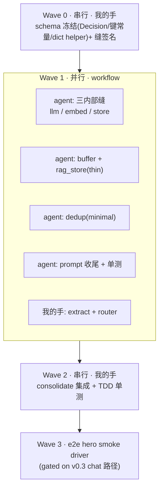

# v0.4 — `memory/` 子系统实现(minimal / hero tier)

> 阶段:把 `docs/memory/DESIGN.md` 的契约落成**可跑的 `memory/` 实现**。串行依赖弱、可大面积并行 → 用 agent team(workflow)编排。
> 性质:**开发前计划**(遵 CLAUDE.md 规则 4)。本文 = 执行计划,**不含实现代码**;开发后在 §13 回填结果。
> 依据:`docs/memory/DESIGN.md`(设计 / 契约)、`docs/v0.2-spike0.md`(SPIKE 0)、`docs/v0.3-chat-keying-planB.md`(chat 路径修复)。

---

## 1. 背景与目标

**现状。** `memory/` 七模块除 `schema.py`(已实现冻结)外全是 stub(`raise NotImplementedError`):
`extract / router / buffer / rag_store / dedup / consolidate` 待实现;`prompt.build_prompt` 已由
SPIKE 0 落地(带可选 `history=()`)。SPIKE 0(v0.2)已验证真 `edit → 热替换 → RAG off 答对`(**raw 路径绿**);
v0.3 正在修 **chat 路径 edit 不触发**(hero blocker)。

**v0.4 目标。** 按 DESIGN.md 把 `memory/` 实现到 **minimal(hero) tier**,解锁写路径(§5)与读路径(§6),
让 hero loop 的 **memory 侧**端到端可跑、可单测;并落地 DESIGN §9 的价值分层测试(load-bearing 模块 +
唯一必过的 e2e hero smoke)。

**不做(full tier 延后)。** Mongo / change-stream 持久化、LLM-judge 去重、coref / 多语言 / 批处理 /
re-rank / token 预算裁剪 / 多轮 history 线程化 —— 全部按 DESIGN 标注延后。不碰 `serving/ eval/ frontend/`
实现;不动 `editing.py` / HoReN 内部(那是 v0.3 的范围)。

**交付物。**
- `memory/` 各模块 minimal 实现(无 `NotImplementedError`)。
- 三个内部缝:`memory/llm.py`、`memory/embed.py`、`memory/store.py`(DESIGN §4.0)。
- Layer-0 收口:`schema` 补 `Decision` + provenance 键常量 + `MemoryItem ↔ dict` helper。
- 测试:`consolidate` + `prompt` 最小 pytest 套;一条 e2e hero smoke driver(`spikes/`)。
- 文档:本计划 + §13 结果回填。

---

## 2. 范围与 tier(每模块做到哪 / 谁的手)

> 「谁的手」遵 DESIGN §8.5 + hackathon 规则 1:判断 / 语义 load-bearing 自己写,机械 / 契约清晰丢 agent。

| 模块 | minimal(v0.4 做) | full(延后) | hero 关键 | 谁的手 |
|---|---|---|---|---|
| `schema`(收口) | 补 `Decision`、provenance 键常量、`to_dict/from_dict` | jsonschema 强校验 | ★ 契约 | **我**(Layer 0) |
| `llm` 缝 | OpenAI SDK→DeepSeek `complete()`,key 经配置,可 mock | 重试 / 结构化输出强校验 | ★ | agent |
| `embed` 缝 | MiniLM `encode()` + 手算 cosine,lazy 单例 | 向量库 / 批 / 缓存 | ★ | agent |
| `store` 缝 | 进程内 dict/list,按 `status` 切片 | Mongo collections | ★ | agent |
| `extract` | 单次 LLM 抽候选 + 逐条 `router.route` 回填 | schema 校验 / 置信度 / coref | ★ 主轴 | **我** |
| `router` | 长度/单句确定性 `atomic` + LLM 小分类 `internalize∧stable` | 稳健分类 + 置信阈值 | ★ 主轴 | **我** |
| `buffer` | 进程内按 id 存、按 `status=="buffer"` 切片 | Mongo + change-stream | ★ 主轴 | agent |
| `rag_store`(thin) | 内存 list + 暴力 cosine top-k | Mongo + chunk + re-rank | ✗(hero RAG off) | agent |
| `dedup`(minimal) | embed-NN + 阈值 → `Decision`(**无** LLM judge) | fast-LLM judge | ✗(几条 distinct≈no-op) | agent |
| `consolidate` | 顺序 dispatch + 内存 registry + 直调 `editing.edit` | Mongo registry / 重试 / 并发 | ★ 核心集成 | **我** |
| `prompt`(收尾) | 对齐 DESIGN §6 版式 + 单测 | token 裁剪 / 多轮 | ★(已落地) | agent |

---

## 3. Layer 0 收口(开工前先冻,阻塞全员)

DESIGN §8.1 要求 `schema` 冻结**必须含** `Decision`,否则 `dedup`/`consolidate` 签名一直吊着 = 没冻。
v0.4 第一步把以下落定并 commit,Layer 1/2 一律对之编码:

1. **`Decision`(随 schema 冻结,方案 A,DESIGN §3.6)**
   ```python
   @dataclass
   class Decision:
       verdict: DedupVerdict            # "duplicate" | "supersede" | "new"
       target_id: Optional[str] = None  # supersede 时 = 被取代旧项 id; 否则 None
   ```
   `dedup.classify(...) -> Decision`(由 stub 的 `-> DedupVerdict` 加宽,DESIGN §4.5)。
2. **provenance 键常量(DESIGN §3.4)**:集中一处定义
   `source_msg / supersedes / superseded_by / edit_ref / consolidated_at / duplicate_of`,避免字符串漂移。
3. **`MemoryItem ↔ dict` helper(DESIGN §3.5)**:`to_dict`(≈`asdict`)+ `from_dict`(轻校验),
   为 `store` 缝 / 未来 Mongo 序列化铺路。
4. **三内部缝的接口签名先定**(实现在 Layer 1):`llm.complete` / `embed.encode` / `store` 的最小 API。

> 冻结即不再改;后续若必须改契约,停下记入 §12 风险并显式同步,绝不静默漂移。

---

## 4. 构建顺序与并行编排(agent team)

> DESIGN §8 已分清:**Layer 0/1/2 是依赖序(谁 import 谁),不是执行甘特图**;执行序 = spike-first + hero-first。
> v0.4 落地为三 wave,Wave 1 用 workflow 吃满并行。



**Wave 0(串行,我的手)** = §3 收口,commit 后解锁全员。

**Wave 1(并行,workflow 编排)** —— 每个 agent 拿到「冻结 schema + 缝签名 + 对应 DESIGN 小节」即可独立干:
- **agent-seams**:`llm`(DeepSeek wrapper)/ `embed`(MiniLM+cosine)/ `store`(内存)。无业务逻辑,契约清晰。
- **agent-buffer-rag**:`buffer`(over `store`)+ `rag_store`-thin(over `embed`+`store`)。纯 CRUD/top-k。
- **agent-dedup**:`dedup`-minimal(embed-NN + 阈值 0.85 → `Decision`,**不**接 LLM judge)。
- **agent-prompt**:`prompt` 对齐 DESIGN §6 两段版式 + 写结构 invariant 单测(纯函数,极便宜)。
- **我的手(与 agent 并行)**:`extract`(LLM 语义抽取 + route 回填)、`router`(shape 判定)—— 语义 load-bearing,不外包。

> 依赖提示:`buffer`/`rag_store`/`consolidate` 依赖 `store` 缝,`rag_store`/`dedup` 依赖 `embed` 缝,
> `extract`/`router`/`dedup`(full)依赖 `llm` 缝。agent 对**已冻的缝签名**编码即可并行,无需等缝实现完成
> (必要时对桩缝跑单测)。`extract` 同层依赖 `router`,但 `router` 接口已冻,可对桩并行(DESIGN §8.1)。

**Wave 2(串行,我的手)** = `consolidate` 集成器 + 单测(TDD,最易错)。消费 `buffer`+`dedup`+`store`/registry+
`editing.edit`(此处对 **mock** 编码与单测,DESIGN §4.6 伪码为准)。

**Wave 3** = e2e hero smoke driver(§8 / §9),gated on v0.3。

---

## 5. 各模块 minimal 实现要点

> 接口一律以 stub 冻结签名为准(本节只补 minimal 逻辑;edge case / full 见 DESIGN §4)。

### 5.1 `extract`(我的手 · ★主轴)
`extract(chat) -> list[MemoryItem]`。① 构抽取 prompt(few-shot:原子化、≤~15 词 proposition,输出 JSON list
`{text,type}`)→ ② `llm.complete` 解析 JSON → ③ 每条建 `MemoryItem`(分配 `id`、`source`=msg id、`ts`、
`status="buffer"`、占位 `route="rag"`)→ 调 `router.route(item)` 回填 `item.route` → ④ 返回 list。
**不**持久化、**不**去重(INV-2)。空/非法 JSON → `[]` + 日志。

### 5.2 `router`(我的手 · ★主轴)
`route(item) -> Route`。`edit` 当且仅当 `atomic ∧ internalize ∧ stable`(INV-1):
- `atomic`:词数/单句的确定性阈值(≤~15 词)——廉价、先算。
- `internalize ∧ stable`:`llm` 缝小分类(few-shot 返回布尔/最终 route);minimal 可叠轻启发式
  (「我喜欢/我是/我用/记住」偏 internalize;URL/代码块/「文档/纪要」偏 rag;「现在/今天/暂时」→ transient→rag)。
- **不确定 → 默认 `"rag"`**(可逆、不动权重;DESIGN §10-10)。只读 `text`(+`type` 弱信号),不读入参 `route`。

### 5.3 `buffer`(agent · ★主轴)
进程内 `dict`(id→item)。`append` = 原样存(`status="buffer"`,无去重);`load_unconsolidated` =
返回 `status=="buffer"` 切片;`drop(ids)` = 按 id 移出。重复 `append` 同 id → 固定为覆盖。深度 =
`len(load_unconsolidated())`。底层走 `store` 缝(buffer 与 registry 共享 `memories` 表按 status 切片,DESIGN §4.0)。

### 5.4 `rag_store`-thin(agent · 非 hero 关键)
`add` = `embed.encode(item.text)` + 存(向量+item,写时 `status="consolidated"`);`search(query,k=5)` =
embed query 取 top-k cosine。内存 list + 暴力 cosine。空库/`k`>库 → 安全返回。**不**做语义去重(dedup 只服务 edit)。

### 5.5 `dedup`-minimal(agent · 非 hero 关键)
`classify(candidate, consolidated) -> Decision`。`embed` 求 cosine 最近邻 `nn`/相似度 `sim`:
`sim < 0.85` → `Decision("new")`;`sim ≥ 0.85` 用相似度+简单规则:近乎一致 → `Decision("duplicate")`,
高相似但取值有别 → `Decision("supersede", nn.id)`。`consolidated` 空 → 一律 `new`。**minimal 不接 LLM judge**(full 升级)。

### 5.6 `consolidate`(我的手 · ★核心集成)
`run_pass(trigger) -> int`。**严格按 DESIGN §4.6 伪码**:取不透明 model 句柄(§7,经 `editing` 缝,**绝不 import serving**)→
`buffer.load_unconsolidated()` → 逐条 `dedup.classify` → dispatch:
- `duplicate`(SKIP)→ `buffer.drop([id])`,不写权重、不计 `n_written`(drain 语义)。
- `supersede` → 先 `editing.edit(model,it)` 成功后再 retire old(`status=retired`、`provenance.superseded_by=new`)、
  写 new(`supersedes`/`edit_ref`/`consolidated_at`)、`buffer.drop`、`n_written+=1`。
- `new` → `editing.edit` → 写 consolidated + `buffer.drop` + `n_written+=1`。

**必须保住的性质**:`editing.edit` 抛错 → 不 drop / 不计 / 不 retire old(留待下趟,幂等自愈);
本趟新固化项加入本趟 registry(同趟可见性,避免一趟内重复写);`n_written` 只数 edit 成功项。

### 5.7 `prompt`(agent · 收尾,已落地)
已实现,带可选 `history: Sequence[dict] = ()`(DESIGN §10-4 标多轮未线程化,默认空兼容 hero)。
v0.4 只:对齐 DESIGN §6 两段措辞/占位「(暂无)」、RAG 窗口结构恒在(INV-5)、写结构 invariant 单测(§8)。

---

## 6. 内部缝实现(DESIGN §4.0)

- **`memory/llm.py`** —— `complete(messages, *, temperature=0.0, response_format=None) -> str`。
  沿用 repo 既有 pattern(OpenAI SDK,`base_url`→DeepSeek,`model="deepseek-chat"`,key 经配置/参数传入,
  **不硬编码读 env、不写进文件**)。被 `extract/router/dedup` 依赖,测试 monkeypatch 这一个函数即脱离真实 API。
- **`memory/embed.py`** —— `encode(texts) -> list[list[float]]`。`sentence-transformers` + `all-MiniLM-L6-v2`,
  cosine 手算(无独立向量库),模型 lazy-load 单例。被 `rag_store/dedup` 依赖,测试 mock 返回确定向量。
- **`memory/store.py`** —— 进程内持久化抽象:`memories` 逻辑表(buffer + consolidated registry,按 `status` 切片)+
  `rag_store` 独立集合。hero 用 module-level dict/list;接口对齐未来 Mongo(`upsert/get/by_status`)。

> 这三缝 + `editing.edit` 是 §8 测试的**四个 mock 点**。

---

## 7. 写 / 读路径接线

- **写路径 dispatch**(`extract → edit→buffer / rag→rag_store`,DESIGN §5)是**薄逻辑、归属 `serving` orchestrator**;
  v0.4 不在 `memory/` 内建它(INV-11)。e2e smoke 里这段 dispatch 写在 driver(`spikes/`),镜像未来 serving 逻辑。
- **consolidate 触发**:hero 用直接 "Consolidate Now" 调 `run_pass("manual")`(DESIGN §4.6 minimal);
  timer/threshold/change-stream 属 `serving/triggers.py`,延后。
- **读路径**:`generate` 调 `prompt.build_prompt` 跑在 edited model(INV-6);hero = buffer 段空 + RAG off(docs 段空),
  骨架恒在(INV-5)。`generate.py` 不在本范围(SPIKE 0 已落地)。

---

## 8. 测试策略(价值分层,DESIGN §9)

> 排序原则:**hero loop 是唯一被评判的东西,不是 test 套件。** 按对 hero 的价值投入,不按模块数铺平。

- **唯一必过 —— e2e hero smoke(真,非 mock)**:RunPod 真模型上
  `真 extract → 真 consolidate → 真 editing.edit(真模型 edit+热替换)→ generate 在 RAG off 下答对`。
  ≈ SPIKE 0 driver。**单测全绿 ≠ hero 成立**;只来得及写一个测试就写这条。driver 落 `spikes/`。
- **高价值 unit(写)**:
  - `consolidate`:dispatch 三路(NEW/SUPERSEDE/SKIP)、draining(跑后 buffer 空含 SKIP)、provenance 落点
    (`edit_ref`/`supersedes`/`superseded_by`)、失败留 buffer(`editing.edit` 抛错→不 drop/不计/old 未 retire)、
    同趟可见性、`n_written` 返回。**边写边配测(TDD)。**
  - `prompt`:结构 invariant(SYSTEM 在、RAG 两段恒在含空占位、措辞区分、query 末位、RAG-off 仍渲染占位)。纯函数极便宜,必测。
- **中价值(轻测/可手动)**:`router` 真值表、`extract` mock-LLM 抽取 —— e2e 已覆盖主路径。
- **低价值(砍/手动冒烟)**:`buffer` CRUD(就是 dict)、`rag_store` top-k(hero RAG off)。
- **四 mock 点**:`llm`/`embed`/`editing.edit`/`store` → 单测脱 GPU/真模型/真 LLM/真 Mongo。
  **只为 `consolidate` + `prompt` 搭最小 pytest 套,不为全模块铺 conftest。**

---

## 9. 与 v0.3 的依赖与过渡

- **memory 模块 + 全部 unit 不依赖 v0.3**:它们对 **mock 的 `editing.edit`** 编码与测试,可与 v0.3 完全并行完成。
- **e2e hero smoke 走 chat 路径 → 依赖 v0.3 chat-keying 修复变绿**(DESIGN §6.4 / §9.1 标的 hero blocker:
  chat 模板下 HoReN edit 不触发)。
- **过渡 smoke(解耦风险)**:v0.3 未绿前,先用 **raw 路径**(SPIKE 0 已绿)跑一条
  `extract→consolidate→editing.edit→generate(raw)` 端到端,**验证 memory 侧 plumbing 正确**,
  把「memory 管道对不对」与「chat keying 触不触发」两个风险分离。v0.3 一绿,切到 chat 路径即得完整 hero smoke。

---

## 10. 护栏(贯穿)

- **绝不装/降级 torch**(复核仍 `2.8.0+cu128` 且 `cuda.is_available()`);只用 Instruct 模型。
- **产物一律 `/workspace`**(模型/缓存/输出),绝不 `/root /home /`(关机清空)。
- **`memory/` 绝不 import `serving/`(INV-11)**;model 句柄经 `editing` 缝(§7),`memory/` 只透传不 inference(INV-7)。
- **不 commit 任何密钥/token**(DeepSeek key 经配置注入,不入库不写文件)。
- **sanity 先行**:e2e smoke 先 N=1 跑通再说;同一错误修 2 次不通即停、贴报错。
- 每完成一个有意义小步即 commit(规则 2);可并行的开发用 workflow(规则 1)。

---

## 11. 验收标准(Definition of Done)

1. `memory/` 七模块 + 三缝无 `NotImplementedError`,minimal tier 全实现;`import memory.*` 全通。
2. `schema` 已含 `Decision` + provenance 键常量 + `to_dict/from_dict`;`dedup.classify` 返回 `Decision`。
3. `consolidate` + `prompt` 单测全绿(覆盖 §8 高价值项)。
4. **e2e hero smoke**:fresh session + RAG off,从**权重**答对一个刁钻问题(chat 路径,gated v0.3;
   v0.3 未绿则 raw 过渡 smoke 先绿)。
5. 不变量复核:重点 **INV-1**(route 按 shape)、**INV-2**(dedup 只在 consolidation)、**INV-4**(no-double-existence)、
   **INV-8**(route 不可逆)、**INV-11**(不 import serving)未被违反。
6. 护栏复核:torch 仍 `2.8.0+cu128`;无密钥入库;产物在 `/workspace`。

---

## 12. 风险(承接 DESIGN §10,仅列 v0.4 相关)

- **★ chat 模板下 edit 不触发(hero blocker)**:e2e hero smoke 的 chat 路径成立依赖 v0.3。缓解 = §9 raw 过渡 smoke 先解耦验证。
- **DeepSeek client 可用性**:`llm` 缝假设 repo 既有 OpenAI-SDK→DeepSeek pattern;若尚未接好,接它属 seam 工作。key 必须经配置、不入库。
- **router 不确定默认 rag**:可能漏固化本应 edit 的项(降 generalization);阈值/默认方向 demo 期可调。
- **dedup-minimal 无 LLM judge**:纯阈值在「同义改写」上召回有限;hero 几条 distinct fact 近乎 no-op,可接受,full 再升级。
- **SUPERSEDE 弱原子性**:retire-old 与 write-new 非事务,采「edit 成功后再 retire」,崩溃下趟自愈(DESIGN §10-8)。
- **store 内存态**:进程重启即失;hero 单进程可接受,full 迁 Mongo(DESIGN §10-5/6)。

---

## 13. 结果(实现完成)

> 用 agent-team workflow 实现:Workflow 1(schema 冻结 → 9 模块/缝并行 → consolidate,11 agent)+ Workflow 2(test_consolidate / test_prompt / smoke,3 agent)。全程 torch 未动(始终 `2.8.0+cu128 True`)。

### 模块完成情况(全 minimal/hero tier)
| 部分 | 文件 | 状态 |
|---|---|---|
| Layer-0 schema 冻结 | `memory/schema.py` | ✅ Decision + 7 个 PROV_* 常量 + to_dict/from_dict(轻校验)|
| 内部缝 | `memory/llm.py` / `embed.py` / `store.py` | ✅ OpenRouter(`qwen/qwen3.7-max`,key 从 gitignored `.env`)/ MiniLM 缓存单例+手算 cosine / 进程内 store |
| Layer-1 | `buffer.py` / `rag_store.py` / `dedup.py` / `router.py` / `extract.py` / `prompt.py` | ✅ 均按 DESIGN §4 实现;extract 产出 `provenance[PROV_EDIT]={stem,target,subject}` |
| Layer-2 | `memory/consolidate.py` | ✅ 注入式 model + lazy import editing(守 INV-11)+ 从 provenance 构造 edit 请求(Q1=A)|

### 验证
- **import sanity**:11 模块全通。**INV-11**:`import memory.consolidate` 后 `serving` 不在 `sys.modules` ✅。schema round-trip ✅。
- **llm 缝实测**:OpenRouter + `qwen/qwen3.7-max` + `response_format=json_object` 返回干净 JSON ✅(修了 `.env` 的引号包裹;默认模型按用户指令 = qwen3.7-max)。
- **单测**:`pytest tests/ -q` → **15 passed in 0.47s**(consolidate 三路 dispatch / drain / provenance / 失败留 buffer / 同趟可见性 / no-provider;prompt 结构 invariant)。

### e2e hero smoke(`spikes/spike_v04_hero_smoke.py`,真模型,GPU)—— **MUST-PASS PASS ✅**
全链:真实 `extract`(OpenRouter)→ `buffer.append` → `consolidate.run_pass`(真 HoReN edit 进权重)→ fresh session + **RAG OFF** 答对。

> 模型 = `qwen/qwen3.7-max`(OpenRouter)。qwen 抽取器在该对话里优先抽出「姓名」事实(而非过敏),smoke 对此鲁棒(测它拿到的那条 edit-route item 的 stem→target)。

| 项 | 结果 |
|---|---|
| extract 路径 | **real-extract**(qwen3.7-max);stem=`The user's name is`,target=`JQ`(LLM 自动分解)|
| PRE(raw, RAG off) | `not displayed in the user list…` —— target **absent**(before/after 干净)|
| consolidate | `n_written=1`,edit latency **4.19s**,**buffer drained**(no-double-existence)|
| **CHAT must-pass(RAG off)** | `JQJQJQ…` **token-EM=1.0 ✅** —— 答案来自**权重**,非 context |
| RAW sanity(RAG off) | hit=True |
| paraphrase bonus(`What is JQ allergic to?`,chat, RAG off) | hit=True 但**不算真 generalization**(target `JQ` 被问句回显;仅 bonus,miss OK)|
| 显存峰值 / 模型加载 | **16.2 GB** / 53.0 s |
| torch 复核 | start/end 均 `2.8.0+cu128 True` |

> 注:生成出现 `JQJQ…` 重复 —— greedy 解码在答出 target 后继续吐 token 所致(cosmetic);target 已命中、token-EM=1.0,hero 证明成立。

### 遗留(full tier / 范围外,延后)
- dedup 的 LLM-judge(minimal 仅阈值)、Mongo/change-stream 持久化、多轮 history、rag re-rank/chunk —— 均按 DESIGN 标注延后。
- `serving/app.py` + `serving/triggers.py` 仍是 stub(/chat dispatch 与 timer/threshold 触发器);hero 由 smoke driver 直接 `set_model_provider` + `run_pass("manual")` 证明。
- greedy 重复可后续加 stop 条件/截断(不影响正确性)。
